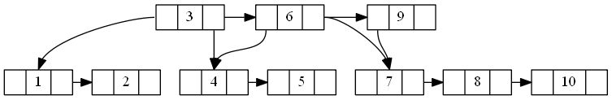

## B树

感觉B树是有点从下往上伸展的感觉,而不是像val树伸展树那些插入一个数据后旋转达到平衡,所以**所有的树叶都在相同的深度上**

* 树中每个结点最多含有m个孩子
* 除根结点和叶子结点外，其它每个结点至少有[ceil(m / 2)]个孩子  **(就是其他节点至少有 ceil(m/2) 个子节点咯)**
* 若根结点不是叶子结点，则至少有2个孩子
* 所有叶子结点都出现在同一层   **(也就是高度相同吧)**

《数据结构与算法分析》上描述的b树(p97)所有数据都在树叶上,但是又没指向下一根的树叶,所以又不是b+树...应该是是另外一种形式吧....所以我还是按照往上那些比较详细的教程来理解吧

插入 1 2 3 4 5 6 7 8 9 10到一个3阶的b树下

插入1

当插入第四个的时候就需要进行处理了,因为我们设置的是三阶的B树

需要将中间的一个移动到上方,拆分成两个子节点(vscode绘图插件貌似语法不是很支持,直接换图了....而且确实是有些毛病)

然后插入5,6,7,8,9什么的直接略过吧,来看看当上一行也满了怎么办

这差不多是一个饱和的状态了,再插入一个10就会,往上增加一个,但是上一行也满了,操作也一样

