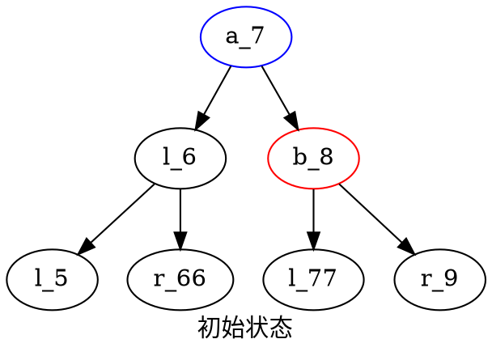
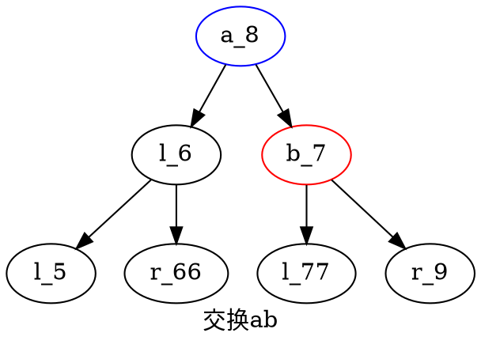
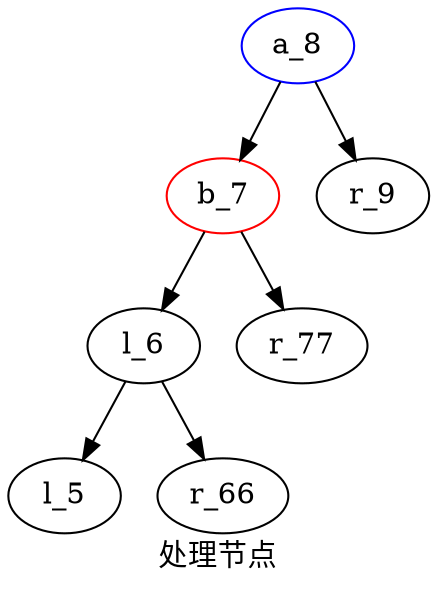

avlTree 自平衡二叉查找树 是在插入的时候进行旋转,使树的深度相同(不超过1)


splayTree 伸展树 是在搜索的时候将节点往上提,提到根节点

单次旋转

```cpp
int tmp = a->data;
a->data = b->data;
b->data = tmp;
```

```cpp
//之后处理节点,需要吧b_7移动到左边,a_8左指向b_7
//b_7左指向原a_8左(l_6),b_7右指向原b_7左(l_77)
//a_8右指向b_7右(r_9)
prt_tree tmp=a_8->lt;
a_8->lt=b_7;
a_8->rt=b_7->rt;
b_7->rt=b_7->lt;
b_7->lt=tmp;
```

