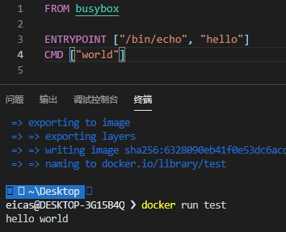
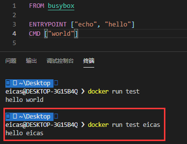
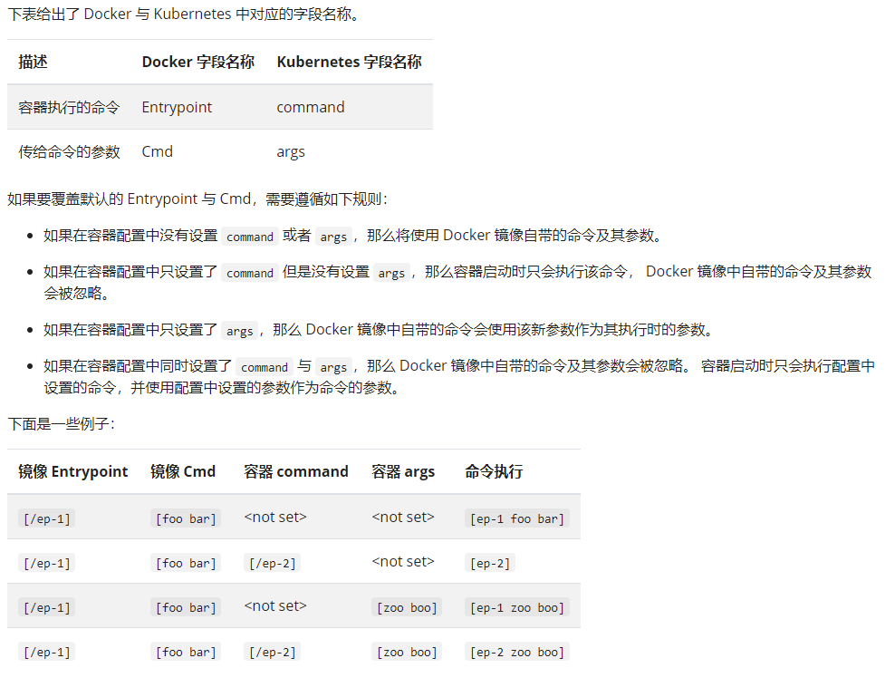
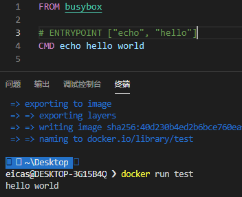
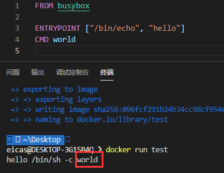
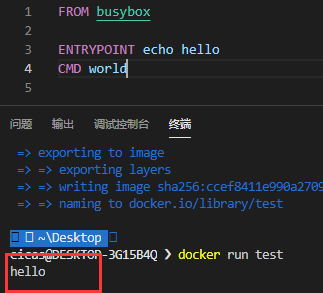

entrypoint是容器执行的命令cmd是执行的命令或者参数.

```bash
docker run --entrypoint /bin/bash test bash
#          覆盖ENTRYPOINT  覆盖CMD
```

```dockerfile
ENTRYPOINT ["/bin/echo", "hello"]
CMD ["world"]
```



像这样执行结果是:`Hello world`

覆盖CMD的参数

```bash
docker run test eicas
```



感觉就像是将两个命令拼接起来

### 在k8s中的对应

[k8s文档地址](https://kubernetes.io/zh/docs/tasks/inject-data-application/define-command-argument-container/#notes)




### CMD和ENTRYPOINT执行的两种形式

```dockerfile
CMD "命令/参数"
# 以shell执行,相当于会自动补全"/bin/sh -c ",等价于CMD ["/bin/sh -c ","\"命令/参数\""],ENTRYPOINT也是如此
```






ENTRYPOINT的shell方式下,无法接受参数



```dockerfile
CMD ["命令/参数","命令/参数"]
# 以exec形式执行
```


