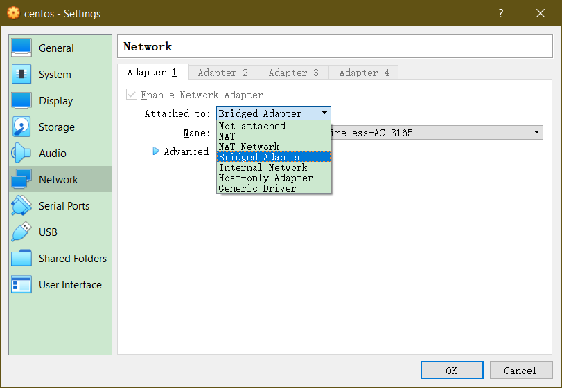

> 最终还是放弃了使用wsl2和docker来运行k8s,安装了虚拟机来使用,后续可能尝试在本地连接虚拟机环境的docker来在本地用docker.
> 主要还是因为wsl2不够完善systemctl不能使用,我这小菜鸡不知道怎么去解决了,docker for desktop的k8s时好时坏.还是虚拟机好使一点...

### 安装虚拟机
我使用的是`VirtualBox`,安装我已经安装好了,网络使用的是桥接,其他没什么可注意的,正常安装,这里我用的是centos.CPU-->2 MEM-->4G



### 安装docker
> 用这些工具安装都是很简单的,主要是网络的问题(我只创建了root账号,所以后面的没有用sudo,用了sudo反而不能用代理,没管那么多了)

按照[https://docs.docker.com/install/linux/docker-ce/centos/](https://docs.docker.com/install/linux/docker-ce/centos/)的来就好了
```bash
export https_proxy=http://proxyip:port
yum install -y yum-utils \
  device-mapper-persistent-data \
  lvm2
yum-config-manager \
    --add-repo \
    https://download.docker.com/linux/centos/docker-ce.repo
yum install docker-ce docker-ce-cli containerd.io
systemctl start docker
# test
docker run hello-world
```

### 设置docker代理
[https://docs.docker.com/config/daemon/systemd/](https://docs.docker.com/config/daemon/systemd/)

```bash
mkdir -p /etc/systemd/system/docker.service.d
vi /etc/systemd/system/docker.service.d/https-proxy.conf
### 输入(和之前的一样)
[Service]
Environment="HTTPS_PROXY=http://proxyip:port"
###
systemctl daemon-reload
systemctl restart docker
systemctl show --property=Environment docker
```


### 然后是minikube
> 主要是代理配置好,就没什么问题,哪里慢也可以配置代理提高速度

#### 获取kubectl和minikunbe
```bash
curl -LO https://storage.googleapis.com/kubernetes-release/release/$(curl -s https://storage.googleapis.com/kubernetes-release/release/stable.txt)/bin/linux/amd64/kubectl && chmod +x kubectl && mv kubectl /usr/local/bin/

curl -Lo minikube https://storage.googleapis.com/minikube/releases/v1.3.0/minikube-linux-amd64 && chmod +x minikube && cp minikube /usr/local/bin/ && rm minikube
```

#### start
```
minikube start --vm-driver=none
```

如果中间有失败的可以删除minikube再重新上面的步骤(尝试记得做快照)
```bash
rm ~/.minikube/ ~/.kube -rf
```

这样就算成功了


- -...弄好干啥,暂时不知道,先弄好吧