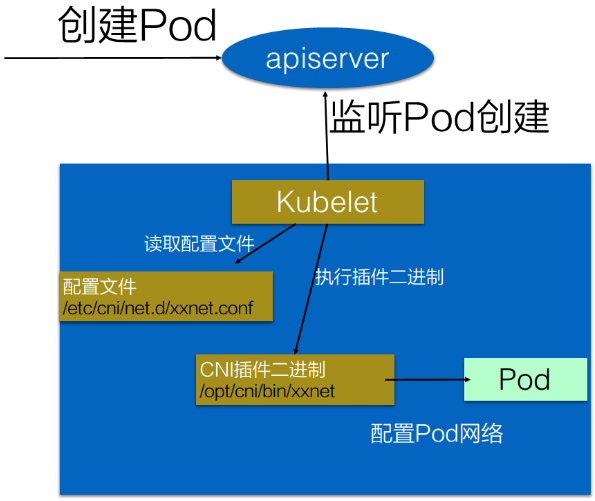
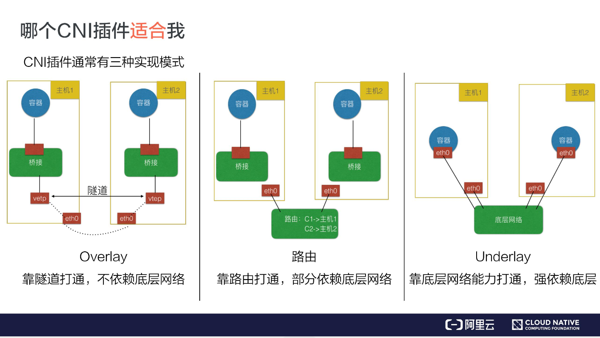

## cri 容器运行时接口

CRI是基于gRPC的

这其中包含了两个 gRPC 服务：

- **RuntimeService**：容器和 Sandbox 运行时管理。
- **ImageService**：提供了从镜像仓库拉取、查看、和移除镜像的 RPC。


Kubelet 作为 CRI 的客户端，而容器运行时则需要实现 CRI 的服务端（即 gRPC server，通常称为 CRI shim）。容器运行时在启动 gRPC server 时需要监听在本地的 Unix Socket （Windows 使用 tcp 格式）。


### 学习资料

* [容器运行时接口（CRI）](https://jimmysong.io/kubernetes-handbook/concepts/cri.html)
* [运行时插件 CRI](https://feisky.gitbooks.io/kubernetes/content/plugins/CRI.html)


## cni  容器网络接口

### 使用

基本的使用方法为：

1. 首先在每个节点上配置 CNI 配置文件(/etc/cni/net.d/xxnet.conf)，其中 xxnet.conf 是某一个网络配置文件的名称；
2. 安装 CNI 配置文件中所对应的二进制插件；
3. 在这个节点上创建 Pod 之后，Kubelet 就会根据 CNI 配置文件执行前两步所安装的 CNI 插件； 
4. 上步执行完之后，Pod 的网络就配置完成了。




cni插件分为三种：Overlay、路由及 Underlay



- **Overlay 模式**的典型特征是容器独立于主机的 IP 段，这个 IP 段进行跨主机网络通信时是通过在主机之间创建隧道的方式，将整个容器网段的包全都封装成底层的物理网络中主机之间的包。该方式的好处在于它不依赖于底层网络；
- **路由模式**中主机和容器也分属不同的网段，它与 Overlay 模式的主要区别在于它的跨主机通信是通过路由打通，无需在不同主机之间做一个隧道封包。但路由打通就需要部分依赖于底层网络，比如说要求底层网络有二层可达的一个能力；
- **Underlay 模式**中容器和宿主机位于同一层网络，两者拥有相同的地位。容器之间网络的打通主要依靠于底层网络。因此该模式是强依赖于底层能力的。


### flannel

#### Flannel 工作模式
支持3种实现：UDP、VxLAN、host-gw，

* UDP 模式：使用设备 flannel.0 进行封包解包，不是内核原生支持，频繁地内核态用户态切换，性能非常差； 
* VxLAN 模式：使用 flannel.1 进行封包解包，内核原生支持，性能较强； 
* host-gw 模式：无需 flannel.1 这样的中间设备，直接宿主机当作子网的下一跳地址，性能最强；

### 学习资料

* [从零开始入门 K8s | 理解 CNI 和 CNI 插件](https://www.kubernetes.org.cn/6908.html)
* [循序渐进理解CNI机制与Flannel工作原理](https://blog.yingchi.io/posts/2020/8/k8s-flannel.html)
* [cni容器网络](https://github.com/containernetworking/cni)
* [cni网络实现](https://github.com/containernetworking/plugins/tree/master/plugins)


## k8s CustomResourceDefinition(CRD 自定义资源)

自定义资源实际上是为了扩展 Kubernetes 的 API，向 Kubernetes API 中增加新类型，可以使用以下两种方式：

* 修改 Kubernetes 的源码，显然难度比较高，也不太合适
* 创建自定义 API server 并聚合到 API 中

创建一个api版本为：`stable.example.com/v1` Kind为：`CronTab` 的CRD：

```yaml
apiVersion: apiextensions.k8s.io/v1beta1
kind: CustomResourceDefinition
metadata:
  # 名称必须符合下面的格式：<plural>.<group>
  name: crontabs.stable.example.com
spec:
  # REST API 使用的组名称：/apis/<group>/<version>
  group: stable.example.com
  # REST API 使用的版本号：/apis/<group>/<version>
  version: v1
  # Namespaced 或 Cluster
  scope: Namespaced
  names:
    # URL 中使用的复数名称: /apis/<group>/<version>/<plural>
    plural: crontabs
    # CLI 中使用的单数名称
    singular: crontab
    # CamelCased 格式的单数类型。在清单文件中使用
    kind: CronTab
    # CLI 中使用的资源简称
    shortNames:
    - ct

# cmd
# kubectl create -f resourcedefinition.yaml
```

使用：
```yaml
apiVersion: "stable.example.com/v1"
kind: CronTab
metadata:
  name: my-new-cron-object
spec:
  cronSpec: "* * * * /5"
  image: my-awesome-cron-image

# cmd
# kubectl apply -f cron.yaml
# kubectl get crontab
# kubectl get ct -o yaml
```

单纯的定义crd资源没有什么用，需要自己写好控制台来执行实际的操作，于是有了下面的[k8s operator](# k8s operator)，Operator=CRD+Controller。

### 学习资料

* [使用CRD扩展Kubernetes API](https://jimmysong.io/kubernetes-handbook/concepts/crd.html)
* [Extend the Kubernetes API with CustomResourceDefinitions](https://kubernetes.io/docs/tasks/extend-kubernetes/custom-resources/custom-resource-definitions/)
* [如何从零开始编写一个Kubernetes CRD](https://www.servicemesher.com/blog/kubernetes-crd-quick-start/)

## k8s operator
> Operator=CRD+Controller 可以提高k8s的扩展性，定义自己的controller

简单来说就是通过CRD定义自己的控制器，然后Controller通过监听CRD的CRUD事件来执行一些操作。

例如：创建一个AppService的CRD资源对象，然后快速部署Deployment、Service等资源。

```yaml
apiVersion: app.example.com/v1
kind: AppService
metadata:
  name: nginx-app
spec:
  size: 2
  image: nginx:1.7.9
  ports:
    - port: 80
      targetPort: 80
      nodePort: 30002
```

### 学习资料

* [Kubernetes Operator 快速入门教程](https://www.qikqiak.com/post/k8s-operator-101/)
* [sample-controller](https://github.com/kubernetes/sample-controller)

