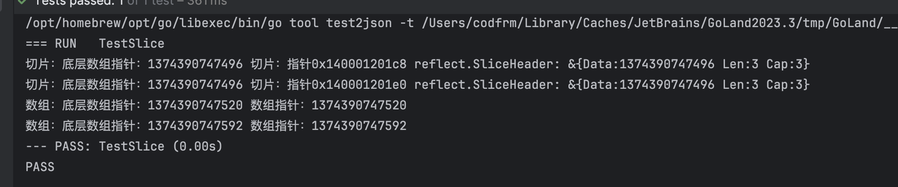
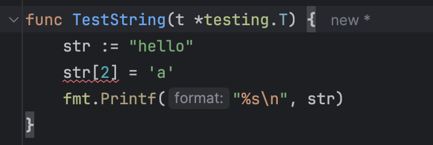

## 切片和数组

切片由三个部分组成：指针(指向底层数组),长度(当前切片使用的长度),容量(切片能包含多少个成员)，可以看`reflect.SliceHeader`的定义，不过这个结构体已经在1.20标注为废弃。

当调用一个函数的时候,函数的每个调用参数将会被赋值给函数内部的参数变量,所以函数参数变量接收的是一个复制的副本,并不是原始调用的变量。(所以数组作为参数,是低效的,还需要进行一次数组的拷贝,可以使用数组指针)

然后如果我们想要传递给一个函数一个数组,函数需要对数组进行修改,我们必须使用数组指针(用 return 当然也不是不行)

但是切片就不需要,来个例子:

```go
func TestSliceArray(t *testing.T) {
	var arr = [...]int{1, 2, 3}
	var slice = []int{1, 2, 3}
	ModifyArray(arr)
	ModifySlice(slice)
	t.Logf("%v %v\n", arr, slice)
	assert.NotEqual(t, arr[2], 1)
	assert.Equal(t, slice[2], 1)
}

func ModifyArray(arr [3]int) {
	fmt.Println(arr)
	arr[2] = 1
}

func ModifySlice(slice []int) {
	fmt.Println(slice)
	slice[2] = 1
}
```

凭啥切片就行,大家明明都长得都差不多。
前面说了,切片是由三个部分组成,然后数组传入的是数组的副本。其实 go 里所有的类型传入的都是对应的副本,切片也是,指针也是的(go值传递)。

那都是拷贝的副本,那么咋切片可以修改?
`切片是由:数组指针,长度,容量组成的`,来划一下重点.
副本传的也是上面这些东西.然后修改切片的时候呢,实际上是通过切片里面的数组指针去修改了,并没有修改切片的值(数组指针,长度,容量).我们可以用unsafe包来看看切片与数组的结构：

```
func TestSlice(t *testing.T) {
	slice := []int{1, 2, 3}
	arr := [...]int{1, 2, 3}
	fmt.Printf("切片：底层数组指针：%d 切片：指针%v reflect.SliceHeader: %+v\n",
		unsafe.SliceData(slice), unsafe.Pointer(&slice), (*reflect.SliceHeader)(unsafe.Pointer(&slice)))
	SlicePointer(slice)
	fmt.Printf("数组：底层数组指针：%d 数组指针：%d\n", unsafe.Pointer(&arr), unsafe.Pointer(&arr[0]))
	ArrayPointer(arr)
}

func SlicePointer(slice []int) {
	fmt.Printf("切片：底层数组指针：%d 切片：指针%v reflect.SliceHeader: %+v\n",
		unsafe.SliceData(slice), unsafe.Pointer(&slice), (*reflect.SliceHeader)(unsafe.Pointer(&slice)))
}

func ArrayPointer(arr [3]int) {
	fmt.Printf("数组：底层数组指针：%d 数组指针：%d\n", unsafe.Pointer(&arr), unsafe.Pointer(&arr[0]))
}

```



可以看到，切片的底层数组指针始终是没有发生变化的，而数组发生了变化。

等看完下面再写另外一个情况,在函数里面,给切片增加成员,会怎么样？

## 切片

定义一个数组和定义一个切片的区别是[...]和\[\](当然还有其他的定义方式)

```go
func Test_DefineSlice(t *testing.T) {
	var arr = [...]int{1, 2, 3}
	var slice1 = []int{1, 2, 3}
	var slice2 = make([]int, 3)
	var slice3 = arr[:]
	fmt.Printf("arr type=%v len=%d cap=%d\n", reflect.TypeOf(arr).String(), len(arr), cap(arr))
	fmt.Printf("slice1 type=%v len=%d cap=%d\n", reflect.TypeOf(slice1).String(), len(slice1), cap(slice1))
	fmt.Printf("slice2 type=%v len=%d cap=%d\n", reflect.TypeOf(slice2).String(), len(slice2), cap(slice2))
	fmt.Printf("slice3 type=%v len=%d cap=%d\n", reflect.TypeOf(slice3).String(), len(slice3), cap(slice3))
}
//Result:
//arr type=[3]int len=3 cap=3
//slice1 type=[]int len=3 cap=3
//slice2 type=[]int len=3 cap=3
//slice3 type=[]int len=3 cap=3
```

上面方法中的切片是会自动创建一个底层数组,如果切片直接引用一个创建好了的数组呢?
我的猜想是在切片里面修改值,原数组也会跟着一起变(切片指针指向的就是这一个数组)
然后我想再验证一下,如果我的切片再增加一个成员(超出数组限制),那么还会变化吗?
我的猜想是会重新分配到另外一个数组去,然后导致引用的数组不会发生改变(切片指针指向的已经是另外一个数组了)

```go
func TestModify(t *testing.T) {
	arr := [...]int{1, 2, 3, 4, 5, 6, 7}
	slice := arr[:]
	slice[4] = 8
	t.Logf("arr[4]=%v,slice[4]=%v\n", arr[4], slice[4])
	assert.Equal(t, slice[4], arr[4])
	slice = append(slice, 9)
	slice[5] = 10
	t.Logf("arr[4]=%v,slice[4]=%v\n", arr[4], slice[4])
	assert.Equal(t, slice[4], arr[4])
	t.Logf("arr[5]=%v,slice[5]=%v\n", arr[5], slice[5])
	assert.NotEqual(t, slice[5], arr[5])
}
```

验证通过^\_^

再来试试两个切片共享一个数组

```go
func TestModifyTwoSlice(t *testing.T) {
	arr := [...]int{1, 2, 3, 4, 5, 6, 7, 8, 9}
	slice1 := arr[1:5]
	slice2 := arr[3:8]
	slice1[2] = 8
	t.Logf("%v %v %v\n", arr, slice1, slice2)
	assert.Equal(t, slice1[2], slice2[0], arr[3])
}
```

一样的全部一起修改成功了

### append

然后我们来看看 append

```go
func Test_Append(t *testing.T) {
	slice := []int{1, 2, 3}
	println(slice)
	slice = append(slice, 1)
	println(slice)
	slice = append(slice, 1)
	println(slice)
}
// Result:
// slice type=[]int len=3 cap=3
// [3/3]0xc00005e3e0
// slice type=[]int len=4 cap=6
// [4/6]0xc00008c060
// slice type=[]int len=5 cap=6
// [5/6]0xc00008c060
```

当容量够的时候切片的内存地址没有发生变化,不够的时候进行了扩容,地址改变了.

### End

再回到最开始,在函数里面,增加切片的成员.我想应该有了答案.

```go
func ModifySlice(slice []int) {
	slice[2] = 1
	slice = append(slice, 4)
	slice[2] = 3
}
```

我把之前的`ModifySlice`方法修改了一下,然后成员没加,后面再修改回去为 3 也没有发生变化了.
这是因为 append 的时候因为容量不够扩容了,导致底层数组指针发生了改变,但是传进来的切片是外面切片的副本,修改这个切片里面的数组指针不会影响到外面的切片


## 切片扩容

在1.18之前，切片的扩容是原来的2倍，但是当容量超过1024时，每次容量变成原来的1.25倍，直到大于期望容量。在1.18后更换了新的机制：

https://github.com/golang/go/blob/27f41bb15391668fa8ba18561efe364bab9b8312/src/runtime/slice.go#L267

- 当新切片>旧切片*2时，直接安装新切片容量计算
- 如果旧切片\<256，新切片容量为旧切片\*2
- 如果旧切片>=256，按` newcap+=(newcap + 3*threshold) >> 2`循环计算（1.25倍-2倍平滑增长），直到大于或者等于目标容量

```go

func TestCap(t *testing.T) {
	slice := []int{1, 2, 3, 4}
	fmt.Printf("len:%d cap: %d\n", len(slice), cap(slice))
	slice = append(slice, make([]int, 11)...)
	fmt.Printf("len:%d cap: %d\n", len(slice), cap(slice)) // oldcap<256，直接使用新切片容量
	slice = append(slice, make([]int, 260)...)
	fmt.Printf("len:%d cap: %d\n", len(slice), cap(slice)) // oldcap<256，直接使用新切片容量
	slice = append(slice, make([]int, 1024)...)
	fmt.Printf("len:%d cap: %d\n", len(slice), cap(slice)) // 1.25倍循环扩容
}

```

至于实际的结果为什么没有和上述说的一样，可以看到，在`nextslicecap`计算出容量后续，还有对`newcap`的一系列操作，这是内存对齐的一系列计算。

https://github.com/golang/go/blob/27f41bb15391668fa8ba18561efe364bab9b8312/src/runtime/slice.go#L188

逻辑比较复杂，可以进入调试模式跟踪逻辑，这里就不多展开了

在此之前我的印象还停留在1.18之前，每次增加2倍和1024按照1024增长，这次复习又学习到不少，还真是学无止境啊。

而且我按照最新的源码来看，与网上大多数的教程说得也有出入，网上很多人都是直接说的1.25倍增长，也许1.18时是这样的（这个我就没有探究了），在现在1.22已经修改成为了上述的公示，可以在1.25-2倍之间平滑增长。


## 字符串

字符串是一种特殊的切片，在go中是一个不可变的字节序列，和数组不同的是，字符串的元素不可修改，可以从`reflect.StringHeader`看到它的底层结构：由一个len长度与data数组指针组成。

之所以说字符串是不可变的是因为如果你直接修改它的下表，那么会直接报错



而如果你修改它的内容，它实际上是又重新申请了一块内存空间：

```go
func TestString(t *testing.T) {
	str := "hello"
	fmt.Printf("%d %+v\n", &str, (*reflect.StringHeader)(unsafe.Pointer(&str)))
	str = "world"
	fmt.Printf("%d %+v\n", &str, (*reflect.StringHeader)(unsafe.Pointer(&str)))
	str = str[:3]
	fmt.Printf("%d %+v\n", &str, (*reflect.StringHeader)(unsafe.Pointer(&str)))
}
```

甚至使用`unsafe`的方式也无法修改，因为内存申请在只读区域，除非你是由其它类型转换过来的。

另外说字符串是一种特殊的切片也是因为字符串能像切片一样进行一些操作，展现出的特性也像切片一样：

```go
func TestStringAsSlice(t *testing.T) {
	str := "hello,world"
	hello := str[:5]
	world := str[6:]
	fmt.Printf("%d %+v\n", &str, (*reflect.StringHeader)(unsafe.Pointer(&str)))
	fmt.Printf("%d %+v\n", &hello, (*reflect.StringHeader)(unsafe.Pointer(&hello)))
	fmt.Printf("%d %+v\n", &world, (*reflect.StringHeader)(unsafe.Pointer(&world)))
}
```

## 高性能编程

一些高性能的编程技巧，其实大多都是为了避免内存拷贝而产生的性能消耗，以下是我想到的几种场景，以供参考，也欢迎指教。

### 零拷贝

在进行string->bytes的转换时使用零拷贝，否则会产生一次内存拷贝，你可以写一个Benchmark来对比一下：

```go
func TestCopy(t *testing.T) {
	str := "hello,world"
	fmt.Printf("%d %+v\n", &str, (*reflect.StringHeader)(unsafe.Pointer(&str)))
	b := []byte(str)
	fmt.Printf("%d %+v\n", unsafe.Pointer(&b), (*reflect.SliceHeader)(unsafe.Pointer(&b)))
}

func TestZeroCopy(t *testing.T) {
	str := "hello,world"
	fmt.Printf("%d %+v\n", &str, (*reflect.StringHeader)(unsafe.Pointer(&str)))
	b := unsafe.Slice(unsafe.StringData(str), len(str))
	fmt.Printf("%s %+v\n", b, (*reflect.SliceHeader)(unsafe.Pointer(&b)))
}

func TestConvertZeroCopy(t *testing.T) {
	n := []int64{1, 2, 3, 4}
	// 注意精度问题
	fmt.Printf("%+v\n", (*reflect.SliceHeader)(unsafe.Pointer(&n)))
	f := unsafe.Slice(unsafe.SliceData(n), len(n))
	fmt.Printf("%v %+v\n", f, (*reflect.SliceHeader)(unsafe.Pointer(&f)))
}
```


### 字符串高性能替换

```go
func TestReplace(t *testing.T) {
	str := "hello,world"
	fmt.Printf("%v %+v\n", str, (*reflect.StringHeader)(unsafe.Pointer(&str)))
	b := []byte(str)
	b[1] = 'a'
	str = unsafe.String(unsafe.SliceData(b), len(b))
	fmt.Printf("%v %+v\n", str, (*reflect.StringHeader)(unsafe.Pointer(&str)))
}
```


