## git 和 github

> git 和 github 其实并不是同一样东西

### git

git 是由`Linus Torvalds`(没错,就是写 linux 内核的那个大佬)开发的一个分布式版本管理系统,主要用于代码的版本控制.
最简单的功能比如:你可以查看你之前的代码提交,与现在的代码进行比较,查看修改了什么内容,如果这个版本出现了 bug,你也可以找到写这个 bug 的罪魁祸首.

还有相同功能的软件:svn.

工具的下载地址:[https://git-scm.com/download/win](https://git-scm.com/download/win) linux 平台可以使用相关包管理工具安装,例如 Ubuntu:`apt install git`.本篇没有对 git 使用说明,可以去看我之前的文章:[Git 命令总结](./Git命令总结)

如果你觉得命令麻烦,也可以去下载 gui 工具,例如:[SourceTree](https://www.sourcetreeapp.com/)

### github

而 github 是一个面向开源软件源码托管的平台,也可以在 github 上建立自己的 git 私有仓库.也是一个大型的同性交友平台(雾)

如果你关注计算机方面的内容,那你应该听过`github万星xxx`.

当然不止软件了,也有很多奇奇怪怪的项目在 github 上收到欢迎.(女装仓库,地球今天毁灭了吗?)

与此相关的平台还有 gitlab(用法和 github 差不多,并且可以自己部署平台)

## 来一个 github 账号

github 账号注册的门槛是很低的,直接访问:[https://github.com/](https://github.com/,),在对话框中输入你的账号就可以了.

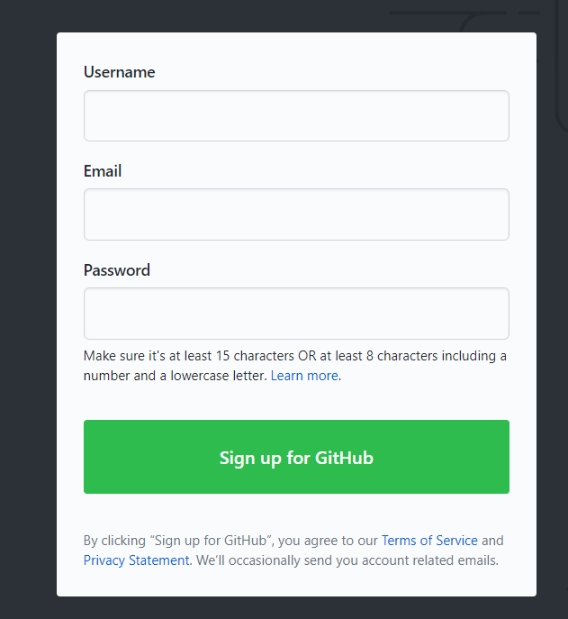

## 主页

> 可以看我的图,应该是很详细了,我的主页是:[https://github.com/CodFrm](https://github.com/CodFrm),欢迎关注和点星星 ⭐?

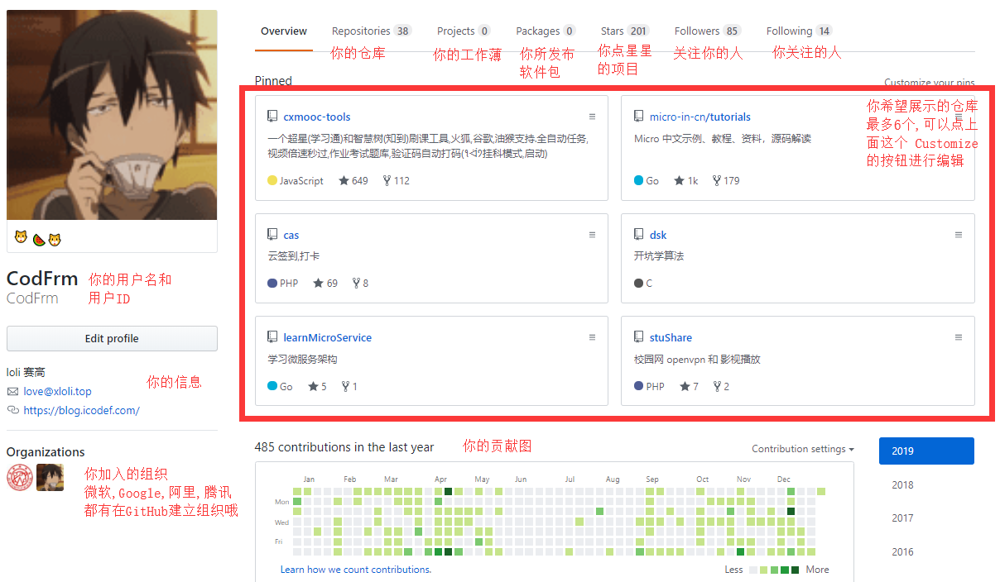

对于想了解你的人来说,第一眼看的应该是 contributions,如果你下方越绿,证明你提交的次数越多,第一映像也会很好(对求职来说),不过也会有一些很无聊的人,提交一些无用的信息去刷 commit.

最下方的贡献图还有一张表情包


所以也是你努力的一种证明啦.

中间的项目,是可以自己选择的,一般都是选自己比较自信的项目放在主页,展示给别人看,如果你给其它项目提交过 pr(pull request,后面会说).你也可以将它展示在你的主页(哪怕你只提交了一行,甚至是给它删了 n 行)

## 仓库

### 创建仓库

你可以在最右上角找到这个,点击就可以进行创建的步骤了

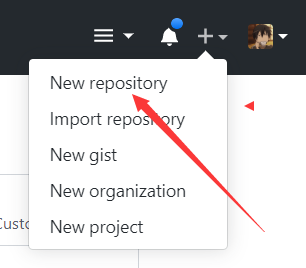

Owner 是仓库的所有者,你可以给自己的账号创建,也可以在组织中创建(有权限的话),public 和 private 表示公有仓库和私有仓库.
`Initialize this repository with a README`是创建一个`README`的文档,以`README`作为文件名的文件,会作为仓库的一个说明文档,显示在你项目主页的下方.

.gitignore 是 git 提交时忽略的文件列表,license 是项目的开源协议(一般都不需要勾选)

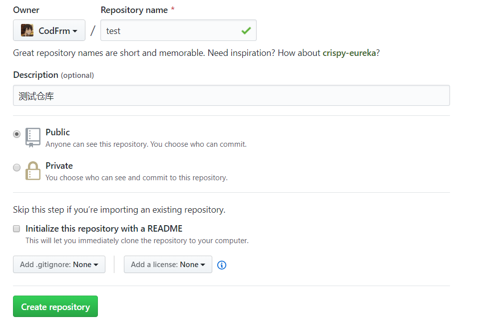

创建完之后会有一些命令引导,提交仓库

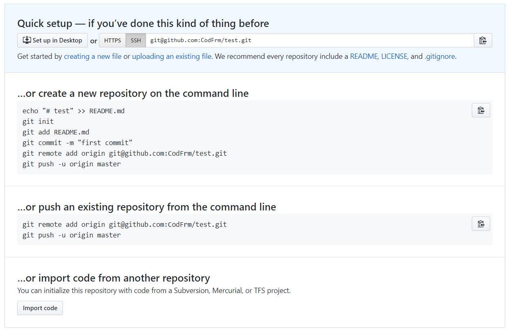

### 提交

#### 添加密钥到 github

提交之前,我们需要安装`git for windows`(如果你是 windows 系统的话),然后打开`Git Bash`,生成密钥添加到 github(因为这里我推荐是使用 ssh 模式,不推荐 https 模式),步骤如下

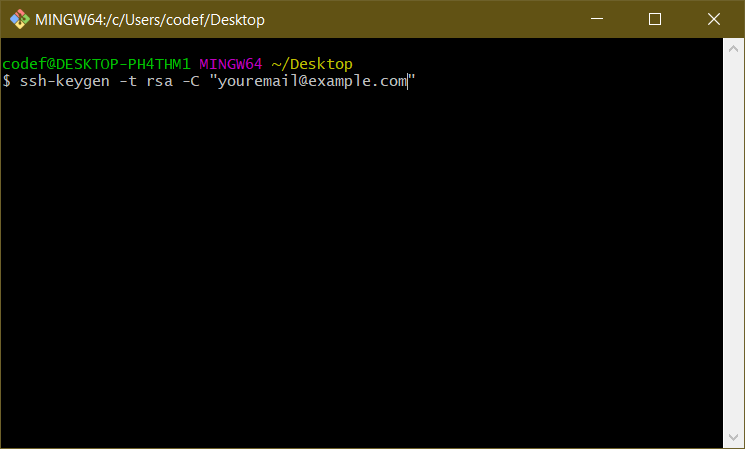

执行`ssh-keygen -t rsa -C "youremail@example.com"`命令就开源了,邮箱为你的注册邮箱,然后输入`cat ~/.ssh/id_rsa.pub`(命令含义就是将你**用户**目录下的.ssh/id_rsa.pub 输出到窗口),会输出一大串字母,这就是你的公钥了,将它复制提交到 github(git bash 要右键,copy,不能 ctrl+c)

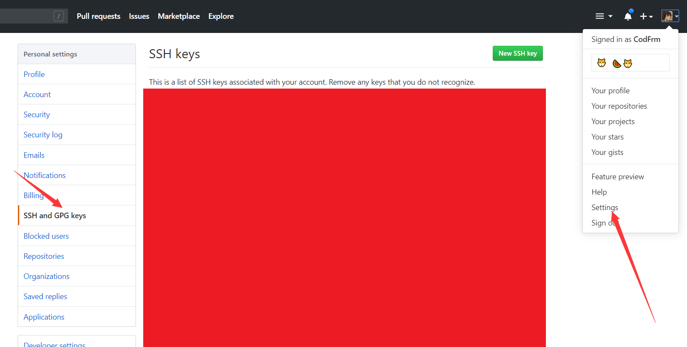

setting->SSH and GPG keys->New ssh key

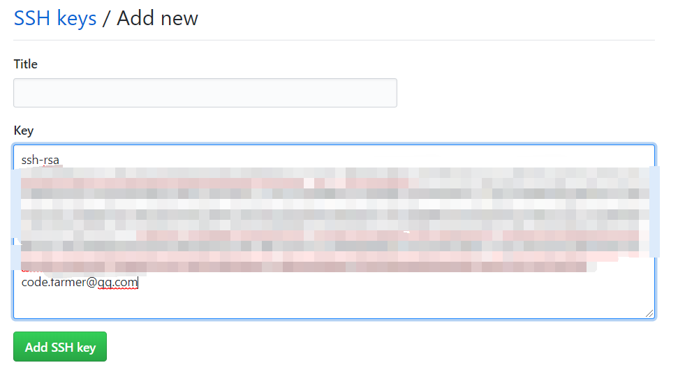

然后 Add ssh key 就 ok 啦,后面好像会要你输入你的密码.

#### 提交源码到 github

依旧是刚刚的`git bash`,如果之前没有 git 仓库,需要先初始化一次,然后绑定远程仓库(远程仓库就是你的 github 仓库啦)

```bash
git init
git remote add origin git@github.com:CodFrm/test.git
```

如果已经有远程仓库了,那么执行第二行就可以了.
然后开始你的代码编写或者加点文件进去....ing
完成后:
命令含义你可以看我的另外一篇博文:[Git 命令总结](./Git命令总结)

```bash
git add *
git commit -m "我添加了一个文件"
git push origin master
```

然后刷新看看 github 上面的仓库主页:

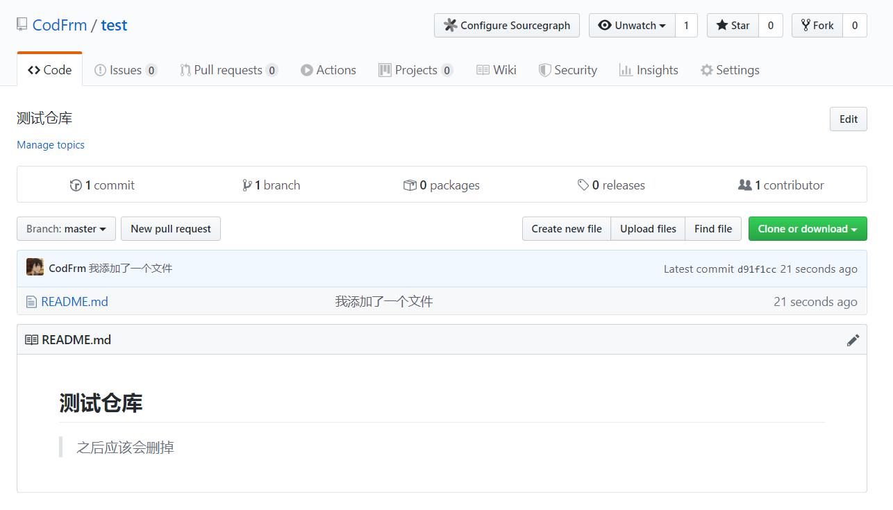

这里我推荐一个插件:[Octotree](https://chrome.google.com/webstore/detail/octotree/bkhaagjahfmjljalopjnoealnfndnagc?hl=en),可以用来看仓库文件,是一个很方便的插件

### 一些常见的东西

#### star

这就是我们常说的星星 ⭐ 了,大概相对于我们的赞吧,越多代表你的项目越受欢迎.(所以快给我点个吧:[https://github.com/scriptscat/scriptcat](https://github.com/scriptscat/scriptcat)?)

#### Watch

你项目的关注人数,当你关注的时候,项目发生更新(新的 issue,pr 等)的时候都会通知你

#### fork

相对于复制一份你的项目,fork 之后,别人就可以帮你修改你的代码.

#### issues

有点像论坛,你的代码出现 bug/问题询问/意见反馈,其他人都可以在这里开一个帖子.

#### pull request

简称 pr,如果你看 issue,你可能会看到仓库作者说,`提个pr`,意思就这个啦.其他人 fork 了你的仓库后,在他自己的仓库对你的代码进行修改,修改好之后,就可以在你的项目里面提交一个`pull request`,你可以将他的修改合并到你的代码里面,当然也可以拒绝.

#### Action

是 github 最近推出的一项 CI/CD 服务, 具体可以去看我原来的文章:[github action 入门](../../ops/CI&CD/github-actions-入门)

#### project

是当前窗口的工作薄,将做些什么内容(不过好像大部分人都没用)

#### wiki

顾名思义,仓库的文章(不过也好像没啥人用...)

#### commit

仓库的提交数量,点进去也可以看到详细的提交内容

#### branch

仓库的分支,点进去可以看到分支详细内容

#### release

当前仓库发布的版本,一般都是可以稳定使用的版本,点进去可以进行下载.

#### contributions

贡献人数,你可以点进去看看有那些大佬为这个仓库做了贡献,然后 follow 他


#### 其它

如果你不想用 git,你也可以在网页上进行一些简单的操作


## 首页

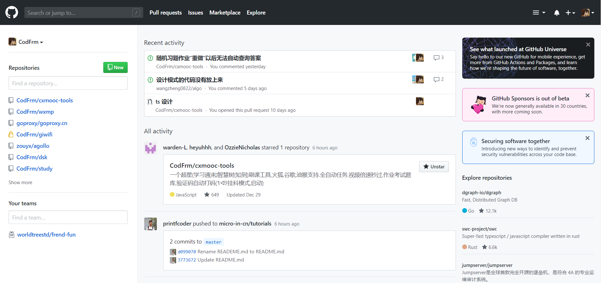

首页其实也没啥,我最主要的用处就是,看那些关注了的大佬的动向,看大佬又 star 了什么厉害的项目,大佬又有什么新的动作了,然后就是一些 github 的新闻之类了

## End

> 推荐几个项目

github 不仅仅是一个程序员的平台,在上面还有漂亮的小哥哥:[https://github.com/komeiji-satori/Dress](https://github.com/komeiji-satori/Dress),帅气的小姐姐:[https://github.com/greenaway07/GirlDress](https://github.com/greenaway07/GirlDress),教你使用 github 的一些基本操作,也有教你炒股买房的教程:[https://github.com/houshanren/hangzhou_house_knowledge](https://github.com/houshanren/hangzhou_house_knowledge).如果你遇到什么需要的东西,也可以去 github 先去搜一搜

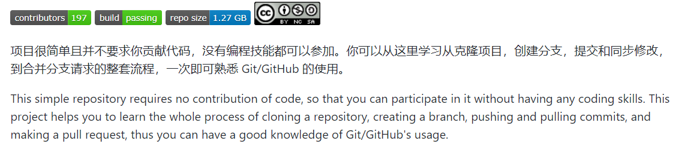

不皮了,安利几个正经的项目:

- [https://github.com/ruanyf/weekly](https://github.com/ruanyf/weekly) 科技爱好者周刊，每周五发布,建议 watch,每天看新报
- [https://github.com/sindresorhus/awesome](https://github.com/sindresorhus/awesome) 各种计算机很棒的资料
- [https://github.com/ruanyf/free-books](https://github.com/ruanyf/free-books) 互联网上的免费书籍
