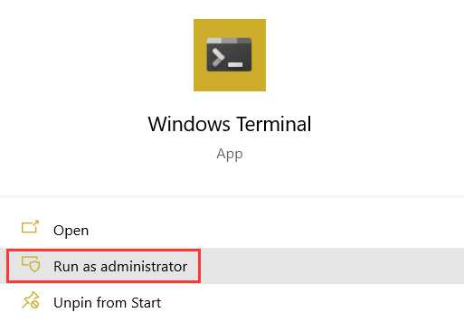
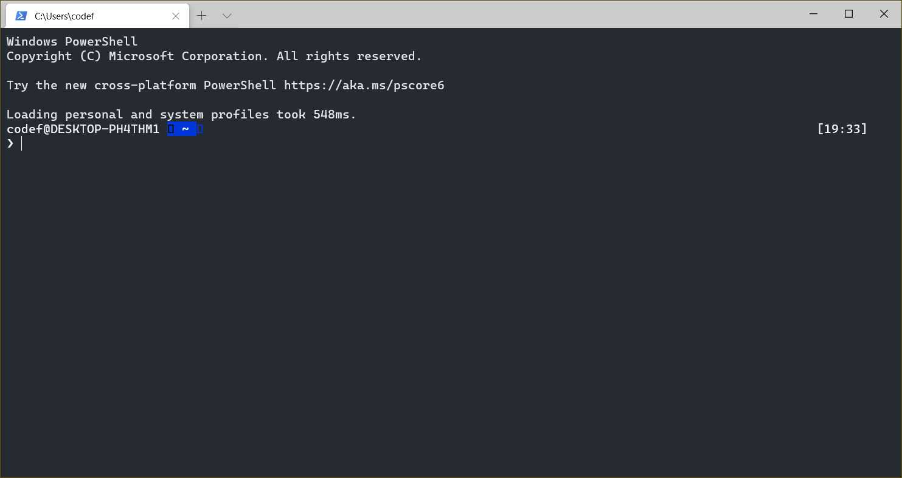
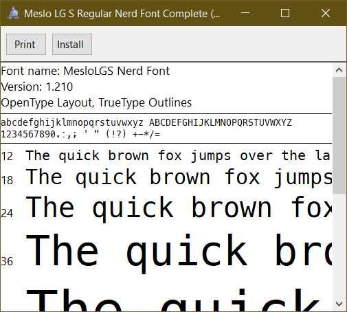
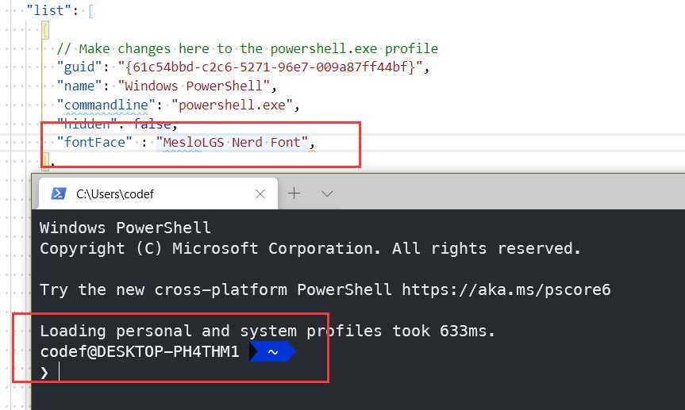
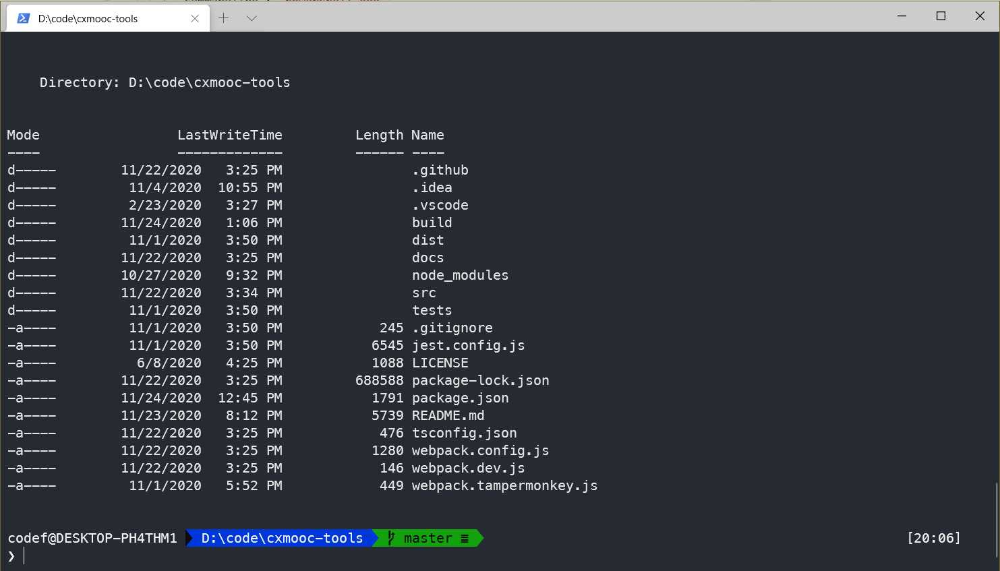
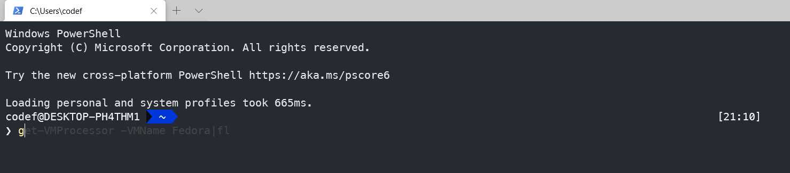

> 作为一名开发人员,经常需要在终端输入一些命令和连接 ssh 啥的,之前一直是使用的 git bash,作为我的默认终端,和使用 xshell 来连接 ssh.在前几日配置,我配置 wsl2+oh-my-zsh 的时候无意间看见了一个 oh-my-posh 的项目,于是就想能不能将 Windows 的终端也像 Linux 配置得那么强大.
> 本篇文章也并不是非常专业的配置,更多的是作为一个分享.现在我已经几乎不再使用 xshell 和 git bash 了.

## Windows Terminal

> [Windows 终端](https://docs.microsoft.com/zh-cn/windows/terminal/)是一个面向命令行工具和 shell（如命令提示符、PowerShell 和适用于 Linux 的 Windows 子系统 (WSL)）用户的新式终端应用程序。 它的主要功能包括多个选项卡、窗格、Unicode 和 UTF-8 字符支持、GPU 加速文本呈现引擎，你还可用它来创建你自己的主题并自定义文本、颜色、背景和快捷方式。(来自官网介绍)

对于这款终端这里也不做更多的介绍了,安装这款终端很方便,已经发布在了 Microsoft Store,直接搜索安装就可以了.

然后是做一些样式的配置,虽然我觉得默认的已经挺好了,这里推荐一个 Theme 的网站,可以选一款自己喜欢的,当然也可以自己配置属于自己的主题:[Andromeda](https://windowsterminalthemes.dev/?theme=3024%20Night)

配置片段:

```json
  "profiles": {
    "defaults": {
      "name": "Andromeda",
      "black": "#000000",
      "red": "#cd3131",
      "green": "#05bc79",
      "yellow": "#e5e512",
      "blue": "#2472c8",
      "purple": "#bc3fbc",
      "cyan": "#0fa8cd",
      "white": "#e5e5e5",
      "brightBlack": "#666666",
      "brightRed": "#cd3131",
      "brightGreen": "#05bc79",
      "brightYellow": "#e5e512",
      "brightBlue": "#2472c8",
      "brightPurple": "#bc3fbc",
      "brightCyan": "#0fa8cd",
      "brightWhite": "#e5e5e5",
      "background": "#262a33",
      "foreground": "#e5e5e5"
    },
```

### 连接 SSH

对于连接 SSH,我们可以直接在 Windows Terminal 里配置一列,就像下面这样:

```json
{
  "guid": "{3a2e18e6-ee47-ff96-582b-adb64c63bf14}",
  "hidden": false,
  "name": "树莓派",
  "commandline": "ssh root@192.168.1.1"
}
```

缺点是不能记住密码,解决方案是配置公私密钥,但是我的密码足够简单且是内网访问...就暂未操作- -...对于复杂的还是使用 xshell,有时间配置免密登录,完全抛弃 xshell.

## 优化 PowerShell

> 分两步,使用[oh-my-posh](https://github.com/JanDeDobbeleer/oh-my-posh)做美化,然后安装一些插件增强功能.虽然还是做不到 linux 下的 zsh 那么强大,插件好少,但是至少比原来的好多了,也足够我用.

### 安装 oh-my-posh

也没那么难,跟着官方文档来就完事了.记得使用管理员权限打开终端.



速度感觉很慢....耐心等待

```bash
Set-ExecutionPolicy Unrestricted
Import-Module PowerShellGet

Install-Module posh-git -Scope CurrentUser
Install-Module oh-my-posh -Scope CurrentUser
```

输入下面命令,编辑配置

```bash
if (!(Test-Path -Path $PROFILE )) { New-Item -Type File -Path $PROFILE -Force }
notepad $PROFILE
```

在弹出的编辑框里面输入下面的内容,主题可以挑一个你喜欢的:[themes](https://github.com/JanDeDobbeleer/oh-my-posh#themes),然后保存

```bash
Import-Module posh-git
Import-Module oh-my-posh
Set-Theme Paradox
```

再重新打开你的终端,就完成了,但是这时候还有一些乱码,我们需要安装字体去解决:[nerd-fonts](https://github.com/ryanoasis/nerd-fonts)



我们去 release 页面下载这个字体,当然也可以自己选择,主要是终端使用到的一些图标字符


下载完成之后,我随便找一个,实在太多了,不知道怎么选择,也可以根据[字体项目的文档](https://github.com/ryanoasis/nerd-fonts/blob/master/readme_cn.md),全部安装下来去挑,不过个人感觉看不出太多变化,我选择了下面这个进行安装:MesloLGS Nerd Font(Meslo LG S Regular Nerd Font Complete.ttf)



然后编辑 WindowsTerminal,使用这个字体就可以了.另外多说一句,`Azure Cloud Shell`无法删除,可以将`hidden`设置为 true 隐藏.



进入一些 git 目录就有下面这种效果啦



### PSReadLine

> PS 在此之前,每次写命令,都要一个一个的打出来,装了之后输入一部分内容就可以自动提示剩余的内容,按下方向右键就可以完成命令.

管理员模式下输入下面的命令

```bash
Install-module PSReadline -Scope CurrentUser
```

然后输入下面命令,编辑配置

```bash
if (!(Test-Path -Path $PROFILE )) { New-Item -Type File -Path $PROFILE -Force }
notepad $PROFILE
```

添加下面内容:

```bash
# PSReadLine
Import-Module PSReadLine
# Enable Prediction History
Set-PSReadLineOption -PredictionSource History
# Advanced Autocompletion for arrow keys
Set-PSReadlineKeyHandler -Key UpArrow -Function HistorySearchBackward
Set-PSReadlineKeyHandler -Key DownArrow -Function HistorySearchForward
```

完成:



