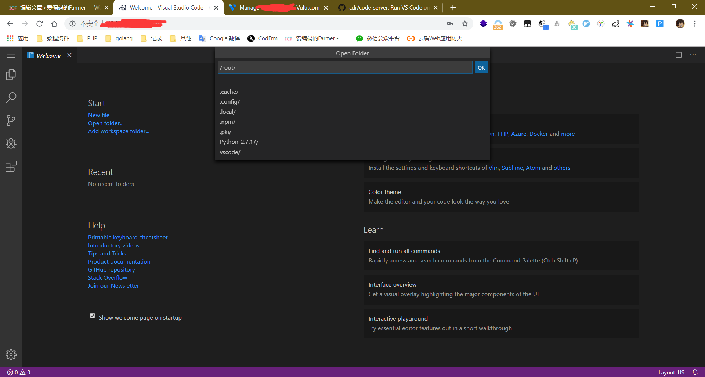
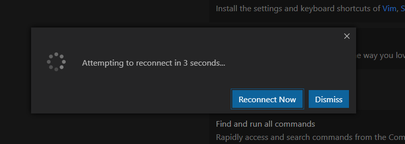
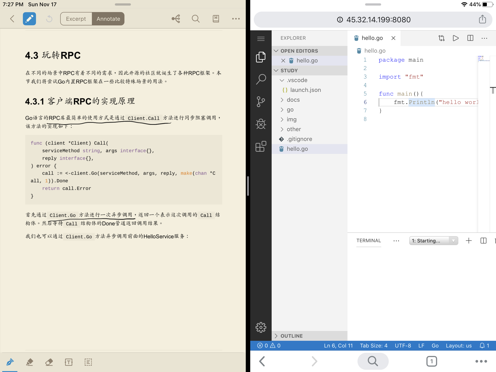

> 今天拿 ipad 看书的时候，想到之前看到的一个文章说可以在浏览器上使用 vscode，而且看书的时候，牵扯到一些函数的参数和具体描述无法知道(难查文档)，就想能不能整一个这样的环境，一边看书也可以一边去**浅度**的了解里面使用的方法,也可以写代码进行调试.

## 准备

一台服务器,我在 [https://www.vultr.com/?ref=7107762](https://www.vultr.com/?ref=7107762) 购买了一台服务器，准备作为环境。(感觉国外的好一点,对于拉包速度之类)

链接服务器的工具,我这里使用的 putty,服务器系统是 centos7

## 安装环境

> 官方说得好模糊....踩了好多坑,也许是我系统太干净的原因?

[https://github.com/microsoft/vscode/wiki/How-to-Contribute](https://github.com/microsoft/vscode/wiki/How-to-Contribute)

```bash
# 装好git curl 之类的必须品
yum install git curl gcc gcc-c++ libX11-devel.x86_64 libxkbfile-devel.x86_64 libsecret-devel sqlite-devel zlib-devel bzip2-devel
# 安装nodejs和yarn
curl --silent --location https://dl.yarnpkg.com/rpm/yarn.repo | sudo tee /etc/yum.repos.d/yarn.repo
curl --silent --location https://rpm.nodesource.com/setup_10.x | bash -
sudo yum install -y nodejs
sudo yum install -y yarn
# 安装python27
wget https://www.python.org/ftp/python/2.7.17/Python-2.7.17.tgz
tar -zxvf Python-2.7.17.tgz
cd Python-2.7.17
./configure
make && make install
# 克隆vscode仓库
cd ..
git clone https://github.com/microsoft/vscode.git
cd vscode
firewall-cmd --zone=public --add-port=8080/tcp --permanent
systemctl restart firewalld
npm install -g node-gyp
# 按照官方的来的,但是好像有问题?有一些地址是localhost,而且文件打不开,可以看下面的方法
git checkout 1.40.1
yarn
yarn watch
yarn web
```

然后我就开始使用另外一个项目,命令和上面的一样,除了上面四行 https://github.com/cdr/code-server ,注意上方`git checkout v1.40.1` 要换成其它版本,如:`git checkout v1.39.2` 见:https://github.com/cdr/code-server/issues/1170 (可能以后会支持吧)

```bash
git checkout 1.39.2
yarn
git clone https://github.com/cdr/code-server src/vs/server
cd src/vs/server
yarn
yarn patch:apply
echo fs.inotify.max_user_watches=524288 | sudo tee -a /etc/sysctl.conf && sudo sysctl -p
yarn watch
yarn start
```

(中间因为服务器太辣鸡了...build 内存不够,然后分配了 4g 虚拟内存解决了...过程中非常卡,服务器都连不上)

完成之后访问 http://ip:8080 就可以用了,`code-server`会要你输入密码,yarn start 会获得





感觉要台网络好的服务器比较好....(我然后装了 bbr 感觉好多了)

可以安装扩展,但是好像装一次扩展然后要重新加载(然后又等很久)

想像体验:


实际体验:
我枯了,bug 比较多,Terminal 跑不起来,代码也不能运行,单单的平板操作很不好(是我需要外接键鼠么?).我觉得还不如用 duet 来分屏.

不过还是很期待以后的版本的.
