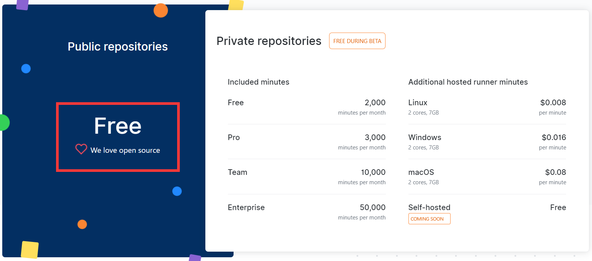

> github 推出了 ci/cd 服务 [https://github.com/features/actions](https://github.com/features/actions) 不过还在内测中,我申请了一下得到了内测资格



## 介绍

github actions 是 github 推出的一款持续集成服务,这里记录下一些概念和基础的使用方法(gitlab 有 gitlab runner,现在 github 终于是推出了自己的 ci/cd 服务)

和 gitlab runner 等其它 ci/cd 工具最大的区别在于,允许引用其它仓库的脚本,并且拥有一个[actions 市场](https://github.com/marketplace?type=actions),这样可以避免很多重复的工作,需要的可以直接引用(才知道 github 有一个这样的市场功能.)

觉得这个和了 Docker hub 的思路是差不多的,可以引用不同的 docker 镜像.gitlab runner 中也可以使用 docker 来实现运行在不同的 ci/cd 运行环境

## 概念

先放出一个 workflow 文件的栗子:

```yaml
name: Greet Everyone
# This workflow is triggered on pushes to the repository.
on: [push]

jobs:
  build:
    # Job name is Greeting
    name: Greeting
    # This job runs on Linux
    runs-on: ubuntu-latest
    steps:
      # This step uses GitHub's hello-world-javascript-action: https://github.com/actions/hello-world-javascript-action
      - name: Hello world
        uses: actions/hello-world-javascript-action@v1
        with:
          who-to-greet: "Mona the Octocat"
        id: hello
      # This step prints an output (time) from the previous step's action.
      - name: Echo the greeting's time
        run: echo 'The time was ${{ steps.hello.outputs.time }}.'
```

### workflow

Workflow 定义一个完整的包括测试,打包,发布,部署等流程.存放再`.github/workflow`目录下,使用 yaml 语法,一个 yaml 或者 yml 文件表示一个 workflow.(就是上面的栗子)

我在使用的时候觉得一个 workflow 文件完全可以满足我的所有需求,但是后来看例子,触发事件是写在最顶级的路径上,所以可能会牵扯到不同的事件运行不同的任务(job),然后写多个 workflow 文件

### job

一个 job 就是实际运行的任务,定义一个 测试/部署/发布 任务,多个 job 合起来就是一个完整的工作流.

### setps

任务所需要执行的步骤,就像一个测试的任务会包括,编译->代码分析->测试->覆盖率->提交结果

### action

一个 action 可以包括多条命令,也可以引用其它仓库的 action.还可以引用 docker 镜像:`uses: docker://alpine:3.8`,这样就更加的灵活了

## 命令

> [https://help.github.com/en/github/automating-your-workflow-with-github-actions/workflow-syntax-for-github-actions](https://help.github.com/en/github/automating-your-workflow-with-github-actions/workflow-syntax-for-github-actions)

再来了解一下会常使用到的一些基础命令,就拿上面的?来说

#### name

描述工作流

#### on

触发的事件,还可以选择定时触发,指定分支 tag 等...

```yaml
on:
  schedule:
    - cron:  '0 * * * *'

on:
  push:
    branches:
      - master
    tags:
      - v1
    # file paths to consider in the event. Optional; defaults to all.
    paths:
      - 'test/*'
```

#### jobs.[id].name

job 名字

#### jobs.[id].runs-on

运行环境,linux,macos,windows 都有,具体可以看:[`jobs.<job_id>.runs-on`](https://help.github.com/en/github/automating-your-workflow-with-github-actions/workflow-syntax-for-github-actions#jobsjob_idruns-on)

#### jobs.[id].steps.[]name

步骤名字

#### jobs.[id].steps.[]needs

job 的依赖,可以确定 job 的运行顺序

```yaml
needs: [job1, job2]
```

#### jobs.[id].steps.[]uses

去引用一个 action/docker 等

#### jobs.[id].setps.[]with

输入的参数,会传入 action 中

#### jobs.[id].setps.[]id

步骤的 id,可以通过 id 再引用到这个步骤

#### jobs.[id].setps.[]run

执行的命令

## 最后

测试项目:[https://github.com/CodFrm/StudyGit/actions](https://github.com/CodFrm/StudyGit/actions)
这里我写了一个例子上去,后面我会使用 actions 作为我公众号的一个自动部署的工具,后面再补上实际的使用?
